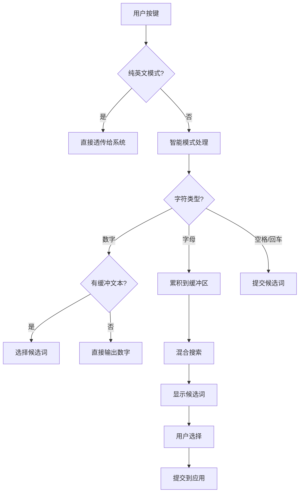

# HallelujahIM 项目深度分析

## 项目概述

HallelujahIM 是一个基于 macOS 的**多语言智能输入法**，采用自动分支技术，无需手动切换模式即可同时支持英语单词联想和中文拼音输入。该项目使用 Objective-C 开发，通过 CocoaPods 管理依赖，实现了现代化的输入体验。

## 核心特性

### 🚀 自动分支技术
- **无需模式切换**：智能判断输入内容，自动搜索英文和中文候选词
- **混合候选词**：在同一个候选词列表中同时显示英文单词和中文词汇
- **一键切换**：右 Shift 键可在智能模式和纯英文模式间切换

### 📚 多语言支持
- **英语单词联想**：基于 22万英语单词的前缀匹配
- **中文拼音输入**：支持拼音到汉字的转换
- **智能排序**：按词频和使用频率排序候选词

### 🧠 智能功能
- **前缀匹配**：使用 Marisa Trie 树进行高效的前缀搜索
- **拼写检查**：Damerau-Levenshtein 距离算法进行模糊匹配
- **音标支持**：Phonex 算法进行语音匹配
- **用户自定义**：支持自定义替换规则

## 技术架构

### 核心技术栈
- **开发语言**：Objective-C
- **依赖管理**：CocoaPods
- **数据存储**：Marisa Trie 树 + JSON 文件
- **Web 界面**：GCDWebServer + Vue.js

### 项目结构
```
hallelujahIM/
├── src/                    # 核心源代码
│   ├── InputController.mm  # 输入控制器（核心逻辑）
│   ├── ConversionEngine.mm # 转换引擎（候选词生成）
│   └── WebServer.m         # Web 服务器（设置管理）
├── dictionary/             # 词典数据
│   ├── google_227800_words.bin    # 22万英语单词 Trie 树
│   ├── cedict.json               # 中英对照词典
│   └── words_with_frequency_and_translation_and_ipa.json
├── web/                    # Web 管理界面
│   ├── index.html          # 设置页面
│   ├── index.js           # Vue.js 应用
│   └── index.css          # 样式文件
├── Pods/                   # CocoaPods 依赖
│   ├── GCDWebServer/       # HTTP 服务器库
│   └── MDCDamerauLevenshtein/ # 字符串距离算法
└── hallelujah.xcworkspace  # Xcode 工作空间
```

## 工作原理

### 输入处理流程



### 候选词生成算法

```objective-c
- (NSArray *)getCandidates:(NSString *)originalInput {
    NSMutableArray *result = [[NSMutableArray alloc] init];
    
    // 1. 用户自定义替换
    if (self.substitutions[buffer]) {
        [result addObject:self.substitutions[buffer]];
    }
    
    // 2. 英语前缀匹配
    NSMutableArray *filtered = [self wordsStartsWith:buffer];
    if (filtered.count > 0) {
        NSArray *sorted = [self sortWordsByFrequency:filtered];
        [result addObjectsFromArray:sorted];
    }
    
    // 3. 拼写检查建议
    if (filtered.count == 0) {
        [result addObjectsFromArray:[self getSuggestionOfSpellChecker:buffer]];
    }
    
    // 4. 中文拼音匹配
    if (self.pinyinDict[buffer]) {
        [result addObjectsFromArray:self.pinyinDict[buffer]];
    }
    
    return result;
}
```

## 数据源分析

### 英语数据
- **Trie 树**：`google_227800_words.bin` - 22万英语单词的高效前缀搜索
- **词频数据**：`words_with_frequency_and_translation_and_ipa.json` - 词频、翻译、音标

### 中文数据
- **中英词典**：`cedict.json` - 中英对照词典
- **拼音映射**：`pinyinDict` - 拼音到中文的映射

### 智能功能
- **模糊匹配**：Damerau-Levenshtein 距离算法
- **音标编码**：Phonex 算法
- **词频排序**：基于使用频率的智能排序

## 依赖库分析

### GCDWebServer
- **作用**：提供 Web 管理界面
- **功能**：静态文件服务 + JSON API
- **端口**：62718（本地安全绑定）
- **界面**：Vue.js 现代化设置界面

### MDCDamerauLevenshtein
- **作用**：字符串距离算法
- **功能**：拼写检查和模糊匹配
- **算法**：Damerau-Levenshtein 距离

## 使用体验

### 智能模式（默认）
```
输入 "hel" → 显示：hello, help, helmet, 你好（如果对应拼音）
输入 "ni" → 显示：nice, night, nine, 你好, 你好吗
输入数字 → 直接输出或选择候选词
```

### 纯英文模式（右 Shift 切换）
```
输入任何字符 → 直接输出（像普通键盘）
```

## 开发特点

### 优势
1. **自动分支**：无需手动切换模式
2. **混合搜索**：同时支持英文和中文
3. **智能排序**：基于词频的智能排序
4. **现代界面**：Web 管理界面
5. **高效搜索**：Trie 树 + 智能算法

### 技术亮点
1. **延迟上屏**：输入法自己管理缓冲和候选词
2. **前缀匹配**：高效的字符串前缀搜索
3. **模糊匹配**：智能拼写检查
4. **多语言融合**：英文和中文无缝集成

## 与纯键盘的区别

| 特性 | 纯键盘 | HallelujahIM |
|------|--------|--------------|
| 输入方式 | 按键 → 立即输出 | 按键 → 缓冲 → 候选词 → 选择 → 输出 |
| 候选词 | 无 | 智能候选词列表 |
| 语言支持 | 单一 | 多语言混合 |
| 智能功能 | 无 | 前缀匹配、模糊匹配、词频排序 |
| 用户体验 | 简单直接 | 智能联想 |

## 总结

HallelujahIM 是一个**多语言智能输入法**，通过自动分支技术实现了英文单词联想和中文拼音输入的无缝融合。它使用现代技术栈，提供了智能的候选词生成、高效的搜索算法和用户友好的管理界面，代表了输入法技术的前沿发展方向。

**核心价值**：让用户在一个输入法中享受多种语言的智能输入体验，无需手动切换模式，真正实现了"输入即智能"的理念。
